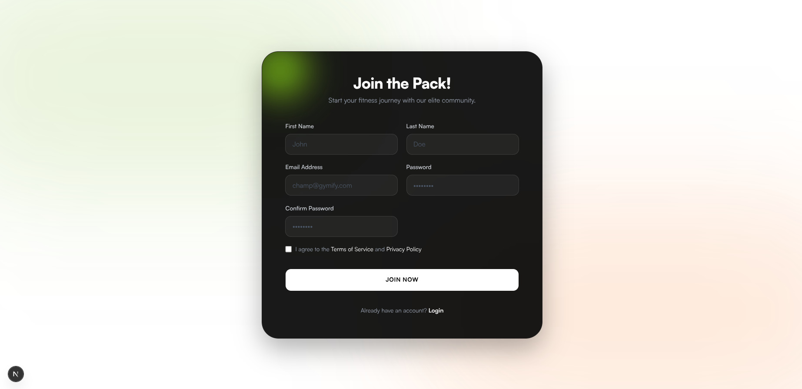
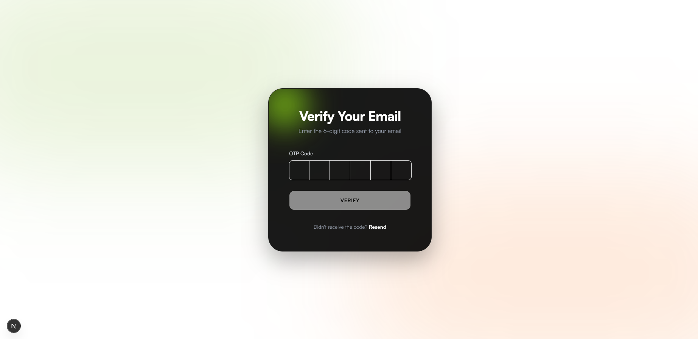

# Gymify - Premium Fitness Landing Page

Gymify is a state-of-the-art landing page for an elite fitness community. Built with modern web technologies, it features a sleek dark-themed design, smooth animations, and a complete authentication flow.

[**Live Demo »**](https://gymify1.vercel.app)  
[**Figma Design »**](https://www.figma.com/design/0NUsWbfIIr9wGQG1fUb09W/Gym-Landing-Page?m=auto&t=4mN6SfIF4H7a7X8O-1)

## Features

- **Dynamic Hero Section**: Interactive elements with vibrant aesthetics.
- **Complete Auth Flow**:
  - **Register**: Split First/Last name fields with direct integration.
  - **OTP Verification**: Secure verification with auto-fill support for testing.
  - **Login**: Seamless access to the community.
  - **Password Recovery**: Integrated forgot/reset password flows.
- **Product Showcase**: Curated list of premium fitness gear.
- **Elite Reviews**: Testimonials from community members.
- **Newsletter**: Stunning subscription section with custom SVG patterns.
- **Responsive Design**: Fully optimized for desktop, tablet, and mobile devices.

## Screenshots


<div style="display: flex; gap: 10px; margin-top: 10px;">
  
  
</div>

## Tech Stack

- **Framework**: [Next.js 16](https://nextjs.org/) (App Router)
- **UI Architecture**: [React 19](https://react.dev/)
- **Styling**: [Tailwind CSS 4](https://tailwindcss.com/)
- **Icons**: [Lucide React](https://lucide.dev/)
- **Components**:
  - [Shadcn/UI](https://ui.shadcn.com/)
  - [Sonner](https://sonner.stevenluo.com/) (Toast Notifications)
- **State Management**: React Context API (`AuthContext`)

## Project Structure

```text
└── 📁src
    └── 📁app
        └── 📁(auth)
            └── 📁forgot-password
                ├── page.jsx
            └── 📁forgot-verify-otp
                ├── page.jsx
            └── 📁login
                ├── page.jsx
            └── 📁register
                ├── page.jsx
            └── 📁reset-password
                ├── page.jsx
            └── 📁verify-otp
                ├── page.jsx
        └── 📁data
            ├── products.js
            ├── reviews.js
        ├── fonts.js
        ├── globals.css
        ├── layout.jsx
        ├── page.jsx
    └── 📁components
        └── 📁auth
            ├── AuthWrapper.jsx
        └── 📁banner
            ├── Banner.jsx
            ├── OurSpecialty.jsx
            ├── ShopAction.jsx
            ├── ShowcaseHero.jsx
        └── 📁banner-bg
            ├── BannerBg.jsx
        └── 📁footer
            ├── Footer.jsx
        └── 📁navbar
            ├── Navbar.jsx
        └── 📁newsletter
            ├── CurveLine.jsx
            ├── Newsletter.jsx
        └── 📁our-products
            ├── OurProducts.jsx
            ├── ProtuctCard.jsx
        └── 📁polygons
            ├── banner-left-pattern.jsx
            ├── common-pattern.jsx
            ├── our-specialty-pattern.jsx
        └── 📁reviews
            ├── ReviewCard.jsx
            ├── Reviews.jsx
        └── 📁section-header
            ├── SectionHeader.jsx
        └── 📁ui
            ├── button.jsx
            ├── input-otp.jsx
        └── 📁why-us
            ├── WhyUs.jsx
    └── 📁context
        ├── AuthContext.jsx
    └── 📁images
        └── 📁banner
            └── 📁shapes
        └── 📁icons
        └── 📁others
        └── 📁products
        └── 📁reviewer
        └── 📁social-media-logos

```

## Getting Started

### Prerequisites

- Node.js
- npm

### Installation

1. Clone the repository:

   ```bash
   git clone https://github.com/sajid-islam/gym-landing-page
   ```

2. Install dependencies:

   ```bash
   npm install
   ```

3. Start the development server:
   ```bash
   npm run dev
   ```

Open [http://localhost:3000](http://localhost:3000) with your browser to see the result.
